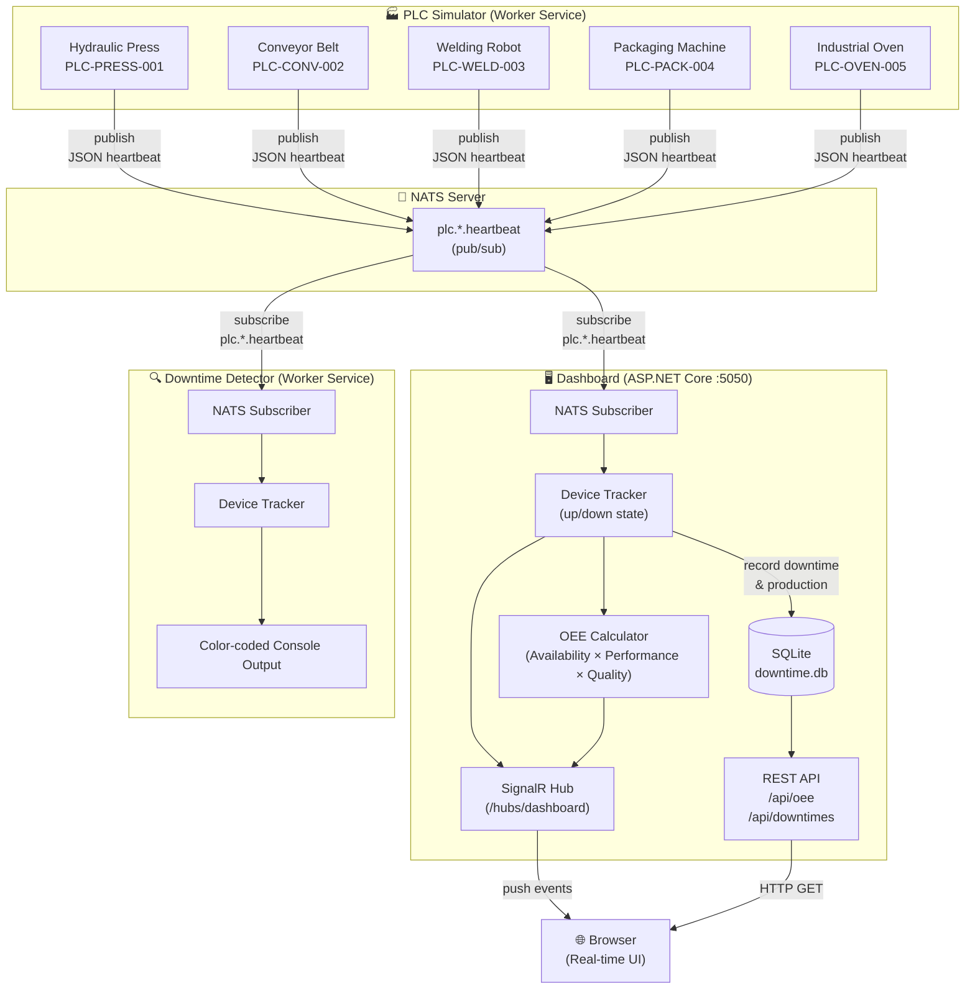
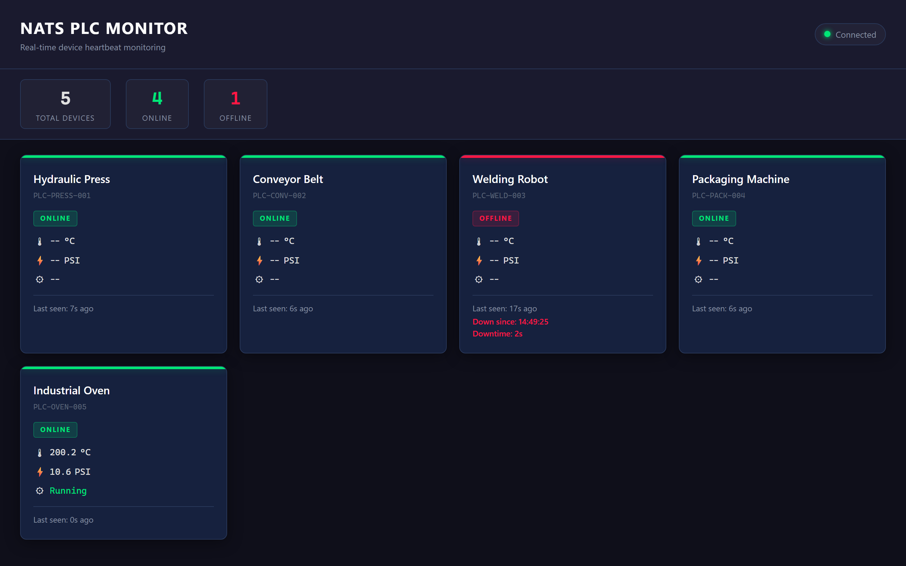
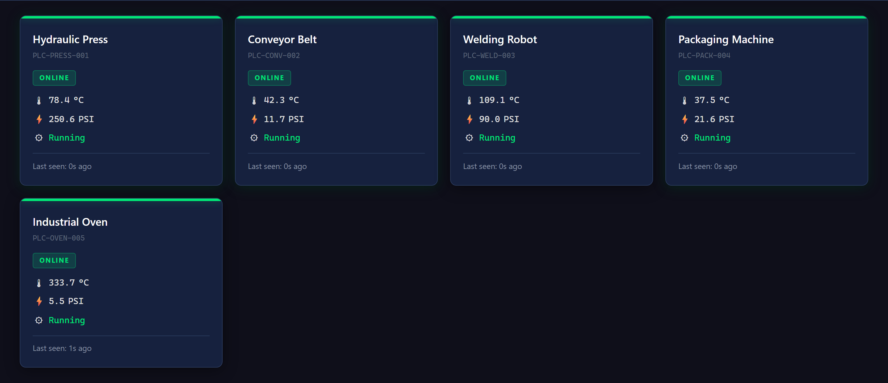
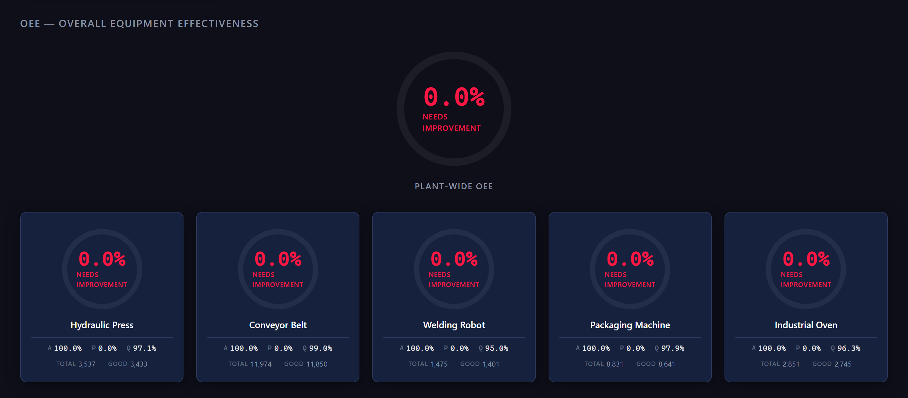
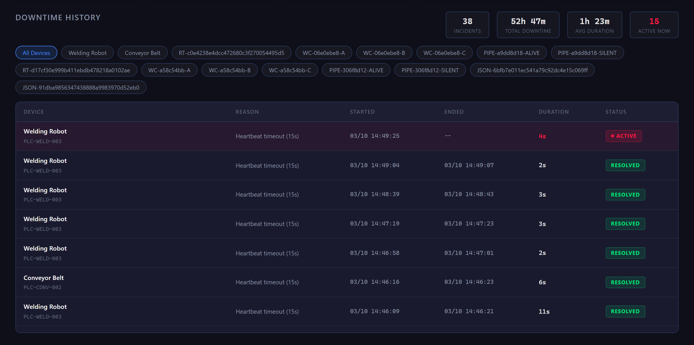
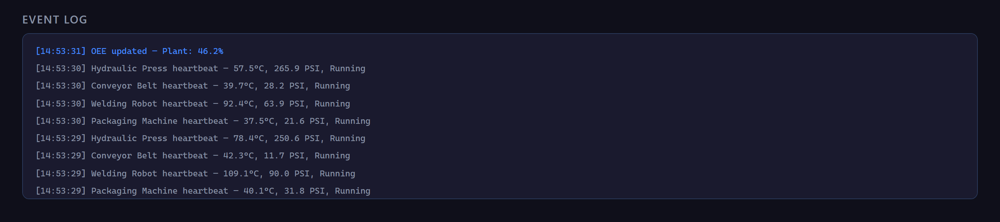

# NATS PoC — Industrial IoT PLC Monitoring with OEE

[](https://dotnet.microsoft.com/)
[](https://nats.io/)
[](https://www.docker.com/)
[](LICENSE)

> **Note:** This project was created entirely with [Squad](https://github.com/bradygaster/squad) — an AI team orchestrator for GitHub Copilot. It is intended for **demo and learning purposes** only.

A .NET 8 project demonstrating **[NATS](https://nats.io/) messaging** in an industrial IoT scenario. PLC devices publish heartbeats with production data, a real-time web dashboard tracks device status, records downtime history in SQLite, and calculates OEE (Overall Equipment Effectiveness) — the gold standard manufacturing metric.

---

### 📑 Table of Contents

[🏗️ Architecture](#️-architecture) · [✨ Features](#-features) · [📋 Prerequisites](#-prerequisites) · [🚀 Quick Start](#-quick-start) · [📸 Screenshots](#-screenshots) · [🔧 Development Mode](#-development-mode) · [⚙️ Configuration](#️-configuration) · [📡 API Endpoints](#-api-endpoints) · [📊 OEE](#-oee--overall-equipment-effectiveness) · [🔬 NATS Concepts](#-nats-concepts-demonstrated) · [📁 Project Structure](#-project-structure) · [🧪 Tests](#-running-tests) · [🛠️ Tech Stack](#️-tech-stack) · [🏭 Simulated Devices](#-simulated-devices)

---

## 🏗️ Architecture

```
┌──────────────────────┐
│   PLC Simulator      │      pub
│   5 PLC devices      │─────────────┐   plc.{id}.heartbeat
│   with production    │             │   (temp, pressure,
│   data & failures    │             │    parts, rejects)
└──────────────────────┘             │
                                     ▼
                              ┌──────────────┐
                              │ NATS Server  │
                              │ (nats:2)     │
                              │ :4222 client │
                              │ :8222 HTTP   │
                              └──────┬───────┘
                                     │
                          sub: plc.*.heartbeat (wildcard)
                                     │
                              ┌──────▼──────────────────┐
                              │   Dashboard (ASP.NET)   │
                              │   :5050                 │
                              │                         │
                              │   ┌─── SignalR ──────┐  │
                              │   │  Real-time push  │  │
                              │   │  to browser      │  │
                              │   └──────────────────┘  │
                              │                         │
                              │   ┌─── SQLite ───────┐  │
                              │   │  Downtime history│  │
                              │   │  OEE snapshots   │  │
                              │   └──────────────────┘  │
                              │                         │
                              │   ┌─── REST API ─────┐  │
                              │   │  /api/oee        │  │
                              │   │  /api/downtimes  │  │
                              │   └──────────────────┘  │
                              └─────────────────────────┘

                              ┌──────────────────────┐
                              │ Downtime Detector    │
                              │ Worker Service       │  Also subscribes
                              │ Color-coded output   │  via plc.*.heartbeat
                              └──────────────────────┘
```


---

## ✨ Features

- **Real-time device monitoring** — 5 simulated PLCs with live up/down status via SignalR
- **Downtime detection** — Automatic detection when devices go silent (configurable timeout)
- **Downtime history** — SQLite-backed log with filterable table showing start time, duration, and device
- **OEE gauges** — Plant-wide + per-device circular SVG gauges (Availability × Performance × Quality)
- **Production simulation** — Devices produce parts with realistic reject rates and varied failure profiles (random outages, flickers, cascading failures, long outages)
- **REST API** — JSON endpoints for OEE and downtime data
- **Downtime detector** — Worker service monitoring device heartbeats with color-coded output (runs in Docker and standalone)

---

## 📋 Prerequisites

- [Docker Desktop](https://www.docker.com/products/docker-desktop/) — that's it, everything runs in Docker.

> For local development without Docker, you'll also need the [.NET 8 SDK](https://dotnet.microsoft.com/download/dotnet/8.0).

---

## 🚀 Quick Start

```bash
docker compose up --build
```

Open **http://localhost:5050** in your browser.

You'll see the dashboard with live device status, downtime history, and OEE gauges — all updating in real time as the simulator runs through failure scenarios.

---

## 📸 Screenshots

**Dashboard Overview** — Real-time device status with stats bar



**Device Grid** — Live heartbeat cards with temperature, pressure, and running state



**OEE Gauges** — Plant-wide and per-device Overall Equipment Effectiveness



**Downtime History** — Filterable log of device outages with duration tracking



**Event Log** — Live stream of system events (connections, heartbeats, status changes)



To stop:

```bash
docker compose down
```

---

## 🔧 Development Mode

For local development, run services individually against a NATS server in Docker.

### 1. Start NATS only

```bash
docker compose up nats -d
```

Verify at http://localhost:8222

### 2. Run any combination of services

```bash
# Terminal 1 — Dashboard
dotnet run --project src/NatsPoc.Dashboard

# Terminal 2 — PLC Simulator
dotnet run --project src/NatsPoc.PlcSimulator

# Terminal 3 (optional) — Standalone Downtime Detector
dotnet run --project src/NatsPoc.DowntimeDetector
```

The Dashboard runs on http://localhost:5050 by default.

---

## ⚙️ Configuration

All services read configuration from `appsettings.json` and environment variables. Environment variables use `__` (double underscore) as the hierarchy separator.

| Variable | Default | Service | Description |
|----------|---------|---------|-------------|
| `Nats__Url` | `nats://localhost:4222` | All | NATS server connection URL |
| `Detector__TimeoutSeconds` | `15` | Dashboard, Detector | Seconds without heartbeat → device is DOWN |
| `Detector__CheckIntervalMs` | `5000` | Detector | How often the detector checks for silent devices |
| `Simulator__IntervalMs` | `5000` | Simulator | Base interval between heartbeat cycles |

In Docker Compose, `Nats__Url` is set to `nats://nats:4222` (the container hostname).

---

## 📡 API Endpoints

The Dashboard exposes these REST endpoints:

| Method | Endpoint | Description |
|--------|----------|-------------|
| GET | `/api/oee` | Plant-wide + all per-device OEE snapshots |
| GET | `/api/oee/{deviceId}` | OEE snapshot for a specific device |
| GET | `/api/downtimes` | Downtime history (last 100 records) |
| GET | `/api/downtimes?deviceId={id}` | Downtime history filtered by device |

SignalR hub at `/hubs/dashboard` pushes real-time updates to connected browsers.

---

## 📊 OEE — Overall Equipment Effectiveness

OEE is the industry-standard metric for manufacturing productivity, calculated as:

```
OEE = Availability × Performance × Quality
```

| Factor | Formula | What it measures |
|--------|---------|-----------------|
| **Availability** | Run Time ÷ Planned Time | % of time the device was actually running |
| **Performance** | Actual Output ÷ Ideal Output | How close to ideal speed the device ran |
| **Quality** | Good Parts ÷ Total Parts | % of parts that weren't rejected |

An OEE of 100% means perfect production: no downtime, full speed, zero defects. World-class manufacturing targets ~85%.

---

## 🔬 NATS Concepts Demonstrated

| Concept | How it's used |
|---------|--------------|
| **Pub/Sub** | PLCs publish, Dashboard and Detector subscribe — fully decoupled |
| **Subject-based routing** | Each device publishes to `plc.{deviceId}.heartbeat` |
| **Wildcard subscriptions** | Subscribers use `plc.*.heartbeat` to receive all devices |
| **JSON serialization** | `NatsJsonSerializer<T>` for typed message deserialization |
| **Auto-discovery** | New devices are automatically detected when they first publish |

---

## 📁 Project Structure

```
nats-poc/
├── docker-compose.yml                 — Full stack: NATS + Simulator + Detector + Dashboard
├── nats-poc.sln                       — Solution file
├── src/
│   ├── NatsPoc.Shared/                — Shared models and utilities
│   │   ├── PlcHeartbeat.cs            — Heartbeat message model
│   │   ├── DeviceTracker.cs           — Device up/down state tracking
│   │   ├── DeviceStatus.cs            — Device status enum
│   │   └── NatsSubjects.cs            — NATS subject constants
│   ├── NatsPoc.PlcSimulator/          — Worker service: 5 PLC devices with failure profiles
│   ├── NatsPoc.DowntimeDetector/      — Worker service: standalone console detector
│   └── NatsPoc.Dashboard/             — ASP.NET Core web dashboard
│       ├── Hubs/DashboardHub.cs       — SignalR hub for real-time updates
│       ├── Services/                  — Background services (NATS, status monitor, OEE)
│       ├── Data/DowntimeDbContext.cs   — EF Core SQLite context
│       ├── Models/                    — OeeSnapshot, DowntimeRecord, ProductionRecord
│       └── wwwroot/                   — Frontend (HTML, CSS, JS)
└── tests/
    └── NatsPoc.Tests/                 — Unit + integration tests (xUnit)
```

---

## 🧪 Running Tests

```bash
dotnet test
```

Tests cover device tracking, downtime history, OEE calculations, SignalR hub behavior, and NATS integration.

---

## 🛠️ Tech Stack

| Technology | Purpose |
|-----------|---------|
| .NET 8 | Runtime |
| NATS.Net v2 | Messaging (pub/sub) |
| ASP.NET Core | Web dashboard + REST API |
| SignalR | Real-time browser updates |
| EF Core 8 + SQLite | Downtime history persistence |
| xUnit + FluentAssertions | Testing |
| Docker Compose | Container orchestration |

---

## 🏭 Simulated Devices

| Device ID | Name | Failure Profile |
|-----------|------|----------------|
| PLC-PRESS-001 | Hydraulic Press | Frequent short outages |
| PLC-CONV-002 | Conveyor Belt | Brief flickers |
| PLC-WELD-003 | Welding Robot | Long outages |
| PLC-PACK-004 | Packaging Machine | Cascading failures |
| PLC-OVEN-005 | Industrial Oven | Frequent short outages |

---

<p align="center">
  <em>Built with <a href="https://github.com/bradygaster/squad">Squad</a> — AI team orchestration for GitHub Copilot.</em>
</p>
